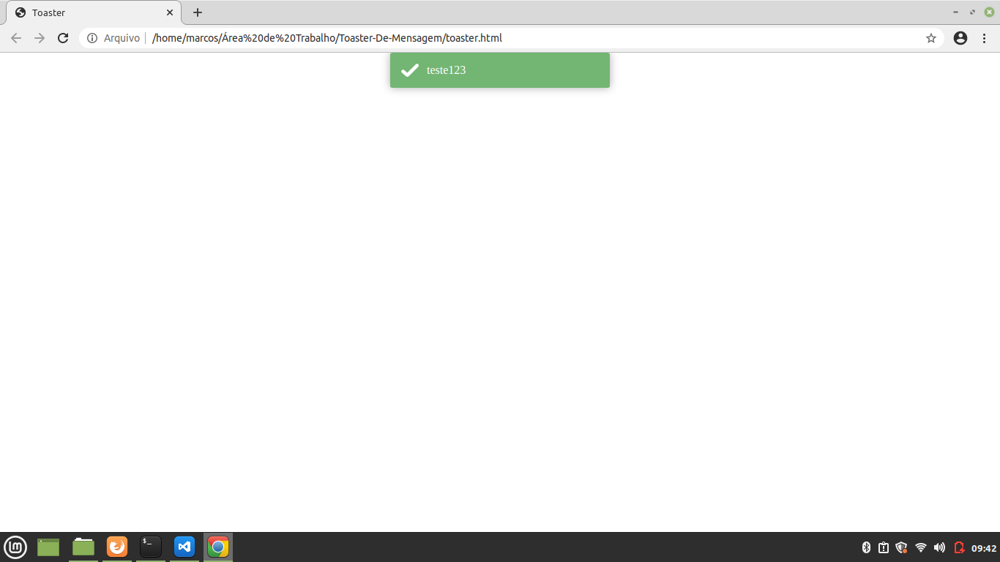

<h1> 🗣 Toaster Messenger 🗣 <h1>

 
    
 Message Toaster sends a notification to the user, this notification can be sent automatically when entering the website / application or when an event occurs where the user will interact with it.

    
 this is very simple toaster messenger.
        <li> Developer in Javascript with Jquery</li>
        <li> Toaster implementation VueJS with Jquery </li>
      
    

 

